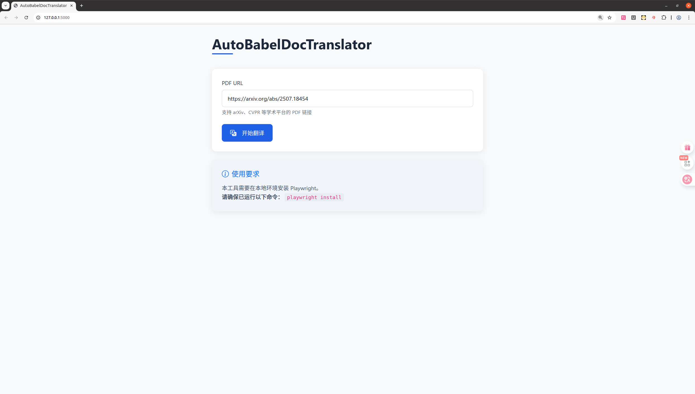

# 🔥 AutoBabelDocTranslator

<div align="center">


</div>

<div align="center">

[](https://github.com/Knighthood2001/AutoBabelDocTranslator/stargazers)
[](https://github.com/Knighthood2001/AutoBabelDocTranslator/network/members)
[](https://github.com/Knighthood2001/AutoBabelDocTranslator/issues)
[](https://github.com/Knighthood2001/AutoBabelDocTranslator/pulls)
[](README.md)
[](README_en.md)

</div>

> **⚠️ 免责声明：**
> 
> 本工具仅供学习交流使用，请遵守 `BabelDOC` 平台的使用条款。任何因使用本工具导致的账号问题或法律纠纷，开发者不承担任何责任。

## 🌟 项目简介

**AutoBabelDocTranslator** 是一个自动化工具，能够将 PDF 文件自动上传至 https://app.immersivetranslate.com/babel-doc 平台进行翻译。支持保留登录状态、自动点击验证和翻译按钮，实现自动化 PDF 翻译流程。


## 项目初衷

我做这个项目的原因，有以下几点：
- 由于自己要阅读大量顶会，顶刊的论文，这些论文都是英文，阅读起来非常困难。
- 一般这些文章，在`arXiv`中都有的，如果要看文章，需要点进去，然后下载下来，此时，还需要给文件命名，这是一个麻烦且重复的步骤。
- **沉浸式翻译**推出的`babel-doc`翻译，效果还是不错的，而且默认是双栏，一栏原文，一栏译文。查阅比较方便。
- 这时候，如果你要使用`babel-doc`翻译，一般步骤，查找英文文章，点开，下载，文件路径和文件名选择，打开`babel-doc`网页，点击上传文献，然后选择文件路径，点击确定，然后点击验证，最后点击翻译。

**可以发现，这是一个非常繁琐的过程，所以我写了这个项目，帮助自动完成这个过程，并且，在arXiv上的文章，能够自动获取文章名称，就可以免去对PDF命名的麻烦事了。**

### 🛠️ 技术原理

- **基于 Playwright**：使用浏览器自动化技术模拟真实用户操作
- **登录态持久化**：保存 cookies 避免重复登录
- **智能等待机制**：自动检测页面元素，确保操作可靠性

## ✨ 功能特性

✅ **自动上传 PDF 文件**  
✅ **一键触发翻译**  
✅ **登录状态持久化**  
✅ **跨平台支持** (Windows/Linux)  

## 📝 链接支持
只支持URL是PDF文件的网页链接

| **网页链接** | **支持情况** | **备注** | 
| ---         |---          |---      | 
| arxiv | ✅ 支持 |能够自动获取论文标题作为PDF文件名|
| CVPR | ✅ 支持 | 能够自动获取论文名称|
| 其他网页PDF |✅ 支持 | 需要自定义PDF文件名|


## 🚀 快速开始

### 📋 前置依赖

1. Python 3.8+
2. Playwright 浏览器驱动

### 🔧 安装步骤

```bash
# 克隆仓库
git clone https://github.com/Knighthood2001/AutoBabelDocTranslator.git
cd AutoBabelDocTranslator

# 安装依赖
pip install -r requirements.txt

# 安装 Playwright 浏览器
playwright install
# 这一步骤可能需要花费较长时间，取决于网络环境
```

### 🏃 使用教程

#### 方式1：上传并翻译 PDF

```bash
python main.py
```

#### 方式2：webUI中使用

```bash
python web/app.py
```
然后访问
```shell
127.0.0.1:5000
```
就能够使用网页界面了。


## 🤝 贡献指南

欢迎提交 Issue 和 Pull Request！

## 💖 致谢

- https://playwright.dev/ - 强大的浏览器自动化框架
- https://app.immersivetranslate.com/ - 优秀的翻译平台

---

<div align="center">
✨ 如果这个项目对您有帮助，请给个 ⭐ Star 支持一下！ ✨
</div>